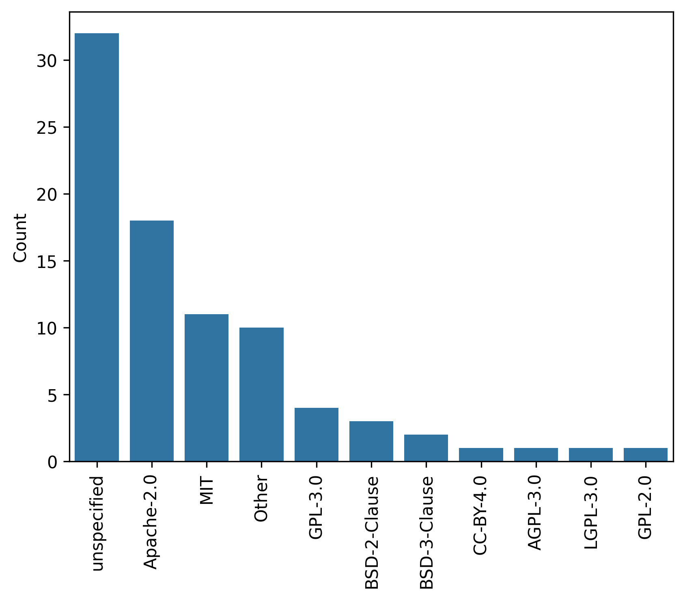

# Open-Source and FAIR Research Software in Proteomics

## Introduction

Studies have shown that over 90% of scientists consider software critical to their research, with nearly 70% stating that their work would be infeasible without it [28751965]. [DSK: I don't know what this reference is, and the start of the sentence says "studies", so I would expect multiple references here.]
This reliance on software is also true in proteomics, and due to recent developments in the field, data analysis and interpretation are increasingly performed with complex software algorithms and tools.
These algorithms and tools play a crucial role throughout the research workflow, from the generation and acquisition of data by mass spectrometers to the subsequent stages of processing, analysis, and interpretation []. 

Computational proteomics, along with algorithm and software development, faces several key challenges common to other omics fields:

- The increasing complexity and size of data acquired by mass spectrometers, the complex sequence of steps, including spectral processing, statistical analysis, and biological interpretation, along with the need to manage algorithmic details and parameter settings, all contribute to making software development in proteomics a complex and demanding endeavor.

- Without structured development practices, proteomics software often struggles to maintain the quality, sustainability, and reproducibility necessary for reliable scientific research. [W: I don't think that OSS doesn't suffer from this.] [DSK: this is a common problem across fields, and structured development practices can only improve it, not solve it.]

- Although most software tools are described in publications, the absence of open-source code, comprehensive documentation, and version control often impedes reproducibility and reuse. 
This lack of accessibility also limits opportunities for computer scientists [maybe this should be researchers?] and developers to contribute effectively to advancing proteomics software. [DSK: I think researchers would be more general.]

Open-source software (OSS) offers a solution to these challenges, empowering proteomics with tools that are not only accessible but also foster community-driven development, rigorous validation, and transparent sharing of methodologies []. [DSK: I don't think OSS is a complete solution, though it helps.]

OSS has demonstrated clear benefits in increasing the accessibility, reusability, and visibility of scientific software [REF?]. 
With code freely available for inspection, modification, and distribution, OSS encourages collaboration and creates avenues for continuous improvement—factors that are critical in fields as data-intensive as proteomics. [DSK: I would say OSS enables collaboration, but I'm not sure it alone encourages it.]

OSS is also aligned with the FAIR Guiding Principles (Findable, Accessible, Interoperable, and Reusable) established for research data, which were expanded in 2022 to address the growing recognition of research software as a foundational research asset []. [DSK: This actually isn't completely true. FAIR4RS (https://doi.org/10.15497/RDA00068) does not require open, no more than FAIR (https://doi.org/10.1038/sdata.2016.18) requires open data. I guess FAIR4RS does encourage OSS, but I'm not sure that I understand what "OSS is aligned with FAIR" means.] 

In this manuscript, we aim to explore the role of OSS in computational proteomics and its implications for the development of FAIR research software. [DSK: be sure to actually cite FAIR4RS (https://doi.org/10.15497/RDA00068) here.] 
We will discuss the benefits and challenges of OSS in proteomics, the role of OSS in the development of FAIR research software, and the importance of distribution, licensing, and citation of software in computational proteomics. 
We will also explore how other omics fields are dealing with OSS and FAIR software, and how these experiences can inform the development of proteomics software. [W: Does the manuscript really do this last part?]

## What does it mean for software to be "open source"? 

OSS (open-source software) refers to software where the source code—the core instructions that define how the software functions—is freely accessible to anyone. 
Unlike "closed-source" or "proprietary" software, where the code remains private, OSS provides transparency by design, which is essential for fostering trust, collaboration, and progress in science.
However, the open- or closed-source label simply addresses code visibility; it is the software license that determines who can use, modify, or distribute the software and under what conditions.

Free and open-source software (FOSS) is a related term that can be misunderstood.
In this context, "free" does not mean free of financial cost, nor does it imply a lack of security or support; instead, it emphasizes the freedom to run, copy, modify, and distribute the software as desired (https://www.gnu.org/philosophy/free-sw.html). [DSK: probably also mention OSI here, as these licenses are generally agreed on to define open source (https://opensource.org/licenses).]
Open-source is often misunderstood as merely free (no financial cost) software or lacking professional quality. 
Many open-source projects are maintained by dedicated teams and backed by extensive testing and security protocols.
For example, in genomics, the Genome Analysis Toolkit (GATK - https://github.com/broadinstitute/gatk), is an Apache 2.0 licensed project with over a hundred maintainers, more than 4000 pull requests from the community, and more than 26,000 citations [20644199].
In proteomics, Percolator (https://github.com/percolator/percolator) is an open-source project with more than 700 citations and 20 contributors [17952086]; and a core tool for multiple open-source tools [], commercial software [], and pipelines [].
The idea that open-source software is of lower quality is a myth that has been debunked by the success of many open-source projects in the field of computational proteomics and bioinformatics.

[W: I moved this paragraph down because I think it makes more sense to first discuss different aspects of OSS, and afterwards transition to closed source.]
In contrast, closed source means that the source code of the software is not published and it is not shared with the public for anyone to look at or change.
A common misconception is that closed-source software with "academic" licenses are equivalent to open-source. [W: What do you understand under academic licenses? Do you mean that the code is open to academics, or just that academics can run the software for free / at reduced cost? This should be defined for the reader.] [DSK: some "closed-source" software actually makes the source available, but limits sharing or other work using is. I think this is the case with some chemistry software that also allows "free" academic usage.]

Adding to the confusion, some journals now require code availability as a condition of publication.
This has led researchers to upload their closed-source software to collaborative code platforms, such as GitHub.
While this provides the appearance of openness through features like issue trackers, the source code remains locked away. [DSK: add "by lack of a license that permits it to be reused".]
Even if well-intentioned, this can be misleading to other scientists and in our view should be discouraged.
Moreover, software licenses in GitHub repositories can change over time, and repositories themselves can even be deleted or made private, making it difficult to ensure long-term accessibility. [DSK: Software Heritage addresses this to some extent, as it will keep an archival mirror of work that has been removed from GitHub.]
To address this, it is best practice for OSS software to also deposit a permanent record on dedicated archival platforms such as Zenodo or Figshare, which provide persistent identifiers like DOIs for long-term citation and access.
These platforms have convenient integrations with GitHub and other code platforms, allowing for easy and automated archival, ensuring that the code remains accessible to the community over time.

| Box 1. How to get started with OSS. The following steps provide a guideline that can foster a successful open-source project that grows in adoption, value, and contributions over time. | [DSK: A bunch of this has been discussed in other papers. Perhaps cite some of them?  eg https://doi.org/10.12688/f1000research.11407.1, https://doi.org/10.1371/journal.pcbi.1004947 are ones I've been part of, but there are many more, I think.]
| --- |
| 1. **Define clear goals and scope.** Start by defining the specific problem or gap your software aims to solve. Ensure it addresses an unmet need or provides a significant improvement over existing solutions. | [DSK: perhaps say that an option is to collaborate with an existing package.]
| 2. **Choose an open source license.** Choose a license that aligns with the project's intended use and desired level of openness. For projects that may later require commercialization or enterprise use, dual licensing (e.g., open-source with an option for commercial licensing) can be considered to support sustainability. |
| 3. **Plan for sustainability.** Research potential funding sources, such as grants, academic support, or partnerships. Decide if the project will rely on donations, grants, or if it might later incorporate paid services. If applicable, consider models like SaaS, support-based revenue, or feature-based licensing that could sustain the project without sacrificing its open-source nature. |
| 4. **Set up a well-structured repository.** Use a collaborative version-control platform like GitHub or GitLab for easy access, community contributions, and versioning. Use clear folder structures, name conventions, and modular code design to enhance usability and maintainability. Provide a clear guide on how others can contribute to the project, including coding standards, pull request policies, and a Code of Conduct to foster a positive collaborative environment. |
| 5. **Develop thorough documentation.** |
|   - User documentation: Provide tutorials, installation guides, and usage examples that lower barriers to entry for new users. |
|   - Developer documentation: Include technical details that make it easier for new developers to understand the codebase, contribute, and debug. |
|   - Version control and changelog: Maintain a detailed changelog for tracking updates, and consider using semantic versioning for releases to help users track changes and updates. |
| 6. **Build a community.** Create forums, mailing lists, or a Slack channel to facilitate communication and support for users and contributors. Promote the project within academic and industry circles, social media, or conferences. Collaborations with other researchers can boost credibility and attract users. Encourage diverse participation, whether from seasoned developers, scientists, or students, by being open to questions, feedback, and contributions of varying levels. | [DSK: mention a code of conduct]
| 7. **Implement rigurous testing and quality control.** Use continuous integration/continuous deployment (CI/CD) practices to automate testing and improve code quality. Platforms like GitHub Actions can be set up to run tests on each new code addition or pull request. Develop a robust suite of tests that ensure functionality and compatibility, minimizing the risk of bugs and ensuring reliability. Regularly review code for quality and potential improvements, inviting experienced contributors or external collaborators to audit the code. |
| 8. **Ensure long-term maintenaince and evolution.** Provide a roadmap that outlines planned features, updates, or long-term project goals. This helps maintainers and contributors stay aligned and gives users confidence in the project’s development. Foster a healthy, engaged community by recognizing contributors, hosting hackathons or sprints, and encouraging new ideas. Consider a governance model where a core group of maintainers or a steering committee manages long-term development, ensuring that the project's mission endures even as individual contributors come and go. |
| 9. **Monitor and measure success.** Track metrics like repository stars, downloads, citations, or code contributions to gauge adoption and impact. Regularly collect user feedback and address concerns or feature requests to ensure the project stays relevant and useful to its audience. |
[W: Open to discussion. Please carefully double-check whether these steps make sense and that I haven't forgotten anything.] [DSK: perhaps check https://github.com/corsa-center/oss-documents/blob/main/README.md]

## Why open-source software is essential for scientific research

### Transparency promotes scientific rigor

The scientific community increasingly acknowledges that algorithms are not merely tools [maybe semantics, but algorithms are not software or tools, right? The algorithm describes the steps, the tool or software is the implementation] [DSK: yes, I agree - I would probably say software packages (or maybe software) are not just tools], but are becoming central research outputs themselves [I feel like this describes software as an output becoming important. Now I read it as the methodological steps being important, which I think has always already been the case]; hence, they are deserving rigorous scrutiny, validation, and reproducibility on par with traditional experimental data. [DSK: they also are outputs, not just support for papers.]
Computational models and algorithms often serve dual roles—as both methods and research subjects—crafted to test hypotheses and drive innovation.
Consequently, the transparency of these implementations is essential to substantiating scientific claims in publications and for critical assessment during peer review.
To draw an analogy, consider a proteomic experiment where only the final mass spectrometry results are shared, without providing details on the sample preparation, instrument settings, or data processing steps.
Without access to this essential information, no other lab could reproduce the experiment, validate the findings, or build on the work effectively.
Similarly, without open-source code, even computational methods of only moderate complexity cannot be fully understood or replicated. [I would say however that just sharing the methodological steps can be done without sharing the code (e.g., see MSFragger). So I do not think this analogy works completely.]

This evolution in the role of computational methods was notably highlighted in 2024 when the Nobel Prizes in Physics and Chemistry recognized breakthroughs in deep learning and protein structure prediction, highlighting the transformative power of computational research in contemporary science.
Yet, the scientific community's commitment to credibility and reproducibility is at risk if these pioneering computational contributions remain closed-source.
Without open-source code, such achievements risk becoming little more than promoted ideas rather than rigorously validated science, as further discussed.
The 2024 AlphaFold3 controversy exemplifies this issue (https://zenodo.org/records/11206103). [DSK: best practice is to cite the DOI (https://doi.org/10.5281/zenodo.11391920), not the URL]
Unlike its predecessors, the AlphaFold3 source code was not released with the publications, preventing independent verification or adaptation of their methods. 

When algorithms or models are considered primary research outputs, implementing them as OSS becomes essential. [DSK: if the algorithm is the research output, it's usually in the form of text, perhaps psuedo-code. Software also can be the output based on an old algorithm, as it's not just the algorithm, it's the specific implementation.]
Inspection of the code allows the scientific community to apply rigorous standards of replication and validation, building upon the same FAIR concepts that we apply to data. [DSK: again, mention FAIR4RS here, not just FAIR.]
OSS ensures that researchers have the opportunity to independently verify results, which strengthens the credibility of the findings and increases confidence in computational methods as scientific tools.
Publishing an algorithm without releasing the code is like publishing experimental results without providing the underlying data [DSK: add "it's not just the data, it's also the methodology, experimental conditions, instrument details, etc.]: it fundamentally hinders scientific transparency.

Even meticulously documented algorithms can vary significantly in their real-world implementation.
Minor differences in programming choices, software dependencies, and hardware environments can alter outcomes in ways that are often invisible in publications.
Even a minor bug in the code, or an unnoticed dependency in a tool or library, can yield dramatically different results—leading to inaccurate biological conclusions and potentially affecting the research outcomes for thousands of scientists who rely on these findings. [DSK: there are papers on such errors that could be cited here.]
The impact extends beyond academic rigor; flawed computational outputs can cascade across studies, introducing errors in scientific knowledge that may influence future research directions, funding priorities, and even clinical practices.
Open code is, therefore, not just a matter of transparency—it is essential for safeguarding the integrity of scientific inquiry and for building a foundation of reliable, reproducible knowledge in computational research.

Open-source code documents the details necessary for researchers to understand precisely how a model or algorithm functions in practice, beyond theoretical descriptions.
This level of transparency is vital to scientific integrity; it ensures that others can accurately replicate studies, identify discrepancies, and reveal assumptions that might otherwise go unnoticed.
It also empowers others—within the constraints of the chosen OSS license—to validate the proposed model or algorithm with alternative implementations and compare it against the original implementation when discrepancies arise. [I think this section could be written in a more positive way. Now it heavily leans toward policing results. Maybe it is also an idea to first discuss how it pushes the field forward (next section), followed by some additional benefits in terms of scientific rigor] [W: Agree.] [DSK: me too.]

### Shared knowledge pushes the field forward

OSS cultivates an ecosystem where researchers across institutions can freely collaborate, improving tools and methods in real time. [DSK: OSS by itself doesn't really do this, but it enables it, particularly if the developers put effort into making it happen.]
Unlike proprietary software, which isolates progress within companies or specific labs, OSS allows researchers to build on each other's work without reinventing the wheel.
This collaborative environment accelerates scientific discovery, as labs and researchers can focus on refining or extending existing algorithms, rather than duplicating efforts.
In this way, OSS promotes the efficient use of resources, turning individual advancements into collective gains.
Indeed, the proteomics field has benefited from this is a number of ways: the ProteoWizard project [18606607,23051804] is a long-standing OSS resource in the proteomics community encompassing beloved tools like Skyline [20147306] and msConvert [28188540].
Numerous plugins have been developed for Skyline to accomplish specialized tasks in a fraction of the time it would have taken to develop the full solution from scratch; currently, there are 20 external plugins available through the official Skyline Tool Store.
Likewise, msConvert has provided a unified interface to open mass spectrometry data formats, rather than requiring developers to wrangle proprietary formats and readers.
Well-supported OSS provides a foundation that accelerates advancement of the field. 

Moreover, OSS democratizes access to high-quality tools, leveling the playing field for researchers in resource-limited settings.
When foundational tools are open-source, scientists at smaller institutions or in countries with limited funding have access to the same technology as those in well-funded labs.
This broad accessibility leads to a greater diversity of ideas and contributions, as scientists worldwide can implement, critique, and enhance these tools.
OSS in science not only enhances rigor and speed, but enables a global community to push the boundaries of knowledge together.

### The community can contribute to development

Open-source software also plays a critical role in iterative refinement.
Bugs and mistakes are inevitable in complex software, and these issues are often best addressed through collaborative scrutiny.
In our own work, users have uncovered bugs that we subsequently corrected, improving the reliability and robustness of our tools.
We have also experienced users asking questions about the underlying code, leading to new features and more efficient algorithms.
This feedback loop is unique to OSS, where the contributions from the community enhance the quality and precision of the software over time.
Without such transparency, computational research can become a "black box" that stifles innovation rather than promoting it, hindering the growth of scientific knowledge. 
OSS can foster a culture of shared accountability, where code is not just released but continuously scrutinized and refined, driving the field forward in a collective effort toward scientific rigor.
We have indeed observed this in our own projects: at the time of writing, QuantMS [38965444] and Mokapot [33596079] now have 12 and 13 contributors, respectively.

### Increasing emphasis on open science and open source by funding agencies

As open science gains prominence, major funding agencies worldwide are implementing mandates to ensure that software developed with public funds is openly accessible.
Horizon Europe, the European Commission's flagship research program, has set stringent requirements for open science, mandating that research outputs, including software, are shared under open or free licenses aligned with FAIR principles (https://commission.europa.eu/about-european-commission/departments-and-executive-agencies/digital-services/open-source-software-strategy_en).
Additionally, all Horizon Europe funded research is required to establish a data management plan (DMP), which is a structured document that outlines plans for open software and code sharing, including tools needed for interoperability.
In the United States, agencies like the National Institutes of Health (NIH) and the National Science Foundation (NSF) strongly encourage, and in some cases require, software and code sharing through public repositories, aiming to maximize reproducibility and scientific transparency (https://datascience.nih.gov/tools-and-analytics/best-practices-for-sharing-research-software-faq).
Similarly, the Wellcome Trust in the United Kingdom mandates that all research outputs, such as software integral to funded research, be made freely available under recognized open-source licenses to facilitate widespread accessibility and reuse (https://wellcome.org/grant-funding/guidance/policies-grant-conditions/data-software-materials-management-and-sharing-policy).
Many other funding agencies all over the world have similar open source guidelines and mandates.
This underscore a commitment from funders to foster collaborative scientific ecosystems, democratizing access to essential research tools and enhancing reproducibility across disciplines.

## Licenses in proteomics software

Before we delve into the role of OSS in computational proteomics, we would like to highlight one of the fundamental aspects and challenges in the development of proteomics software: the use of software licenses.
These licenses often target commercialization, code reuse, but also distribution and citation. 

As the gold standard for proteomics software development we recommend to use a standard OSS license (**Figure 1**), like Apache 2.0, MIT, BSD, LGPL, GPL, etc.; a list of them can be found at (https://opensource.org/licenses).
These licenses are well known, are in use across many fields, and are well understood by the community.
Additionally, they are compatible with the FAIR principles and the Open Source Initiative (OSI) guidelines [REF].
These established licenses all have a clear definition of what is allowed and what is not, and how the software can be distributed, reused, and cited.

**Figure 1.** Open source software licenses in use in proteomics. Scientific papers published in the _Journal of Proteome Research_ that include a GitHub URL in their abstract were automatically retrieved from PubMed and information on the software license of the corresponding GitHub repository was retrieved through the GitHub API.
Many proteomics code repositories do not have a license specified, in addition to several OSS licenses being used.
The code to generate these data is available at https://gist.github.com/bittremieux/70905e5d9dcc829ae49aab49e85954af.

In addition, as the field is evolving, and software becomes more complex and has multiple components, different components could have a different license and the dependencies between them should be clearly stated.
It is therefore recommended to clearly state the dependencies that a piece of software might have, and the licenses of each of them.
This will help the user to understand the software, the developers to know what they can use, and the journal reviewers to understand the software and its implications.
For example, if a software tool that performs PTM-site localization is distributable, but the software that produces the PTMs, peptide identification inputs, etc., is not, it could be misunderstood that the software is open-source, when in reality, all the main components that it relies on are not.
Full disclosure of such dependencies is necessary to ensure that the user is aware of this, such that the community, developers, and journal reviewers are able to understand this challenge.

## Strategies to commercialize OSS

Merely the fact that a piece of software is open-source does not necessarily mean that everyone can use it without financial cost.
Instead, OSS can be commercialized in a number of different ways depending on the owner's goals and principles.
Here, we intend for commercialization to refer to any process by which OSS is monetized, regardless of whether it remains part of an academic lab, is developed by a company, or is spun-out into its own startup.
In fact, we would argue that healthy OSS projects must be financially supported by methods such charitable means, grants, or commercialization, in order for the development of the project to be sustainable.
Here, we discuss a few commercialization models that have become popular with OSS, which try to strike a balance between supporting openness and supporting future development.
It is worth noting that these strategies are not necessarily mutually exclusive.

**Dual licensing.**
A popular commercialization option for OSS has been to offer the software under multiple licenses.
Projects using this strategy are often available under a strong copyleft license (GPL, AGPL, etc.) with no financial cost.
However, the copyleft nature of these licenses requires any derivative works to published under a compatible open-source license, which is often undesirable for corporate users.
Thus, these projects also offer more permissive licenses to paying customers, which allows using the OSS project within proprietary code.
Although this strategy may seem easy to abuse, our experience has been that companies are often risk-averse and would rather purchase proper licenses rather than risk legal ramifications of violating a copyleft license. 
A successful example of this strategy from outside of proteomics has been RStudio by Posit.
RStudio is currently available under an open-source AGPLv3 license, or under a commercial license when AGPLv3 is incompatible.
Notably, developers should make sure to include a "contributor license agreement" as part of their requirements for new contributors to ensure their contributions can be distributed under both licenses.

**Support or services.**
Some OSS projects commercialize by offering support services or new feature development at a cost.
Often users, particularly from corporate entities, are willing to pay for specialized training and ongoing support for their use of OSS projects.
In special instances, it may even be the case that outside entities are able to pay for the prioritization of specific features.
This road must be tread carefully though; while there is benefit to allowing sponsored features, and they do benefit everyone once implemented, such a model risks losing control over the direction of an OSS project.
Red Hat is the most prominent example of a company using this strategy to commercialize their enterprise Linux offering. 

**Software as a service (SaaS).**
The SaaS commercialization model has become increasingly popular in recent times. 
When using a SaaS model, the OSS project remains open-source, but commercialization occurs by building a platform around it.
The platform then allows users to more easily use the OSS project.
This model often includes a managed hardware or cloud infrastructure component, where users pay to interact with a web application to use the OSS tool, reducing the barrier to entry.
In the bioinformatics space, NextFlow [28398311] is an open-source bioinformatics workflow engine that has been commercialized by Seqera Labs using the SaaS model.
Their current Seqera Platform product provides an interface to launch, observe, and explore workflow executions with NextFlow, in addition to other features. 

**Open-core.**
The open-core commercialization model provides access to new features only to paying customers.
Often this is not fundamental functionality, but rather optional features such as a nicer user interface or early access to new features.
Some variants of this model use a time delay for new features, where paying users have access to new features sooner than those using the fully OSS version.
Practically, the implementation of this strategy often involves the creation of a private, upstream fork of the OSS code repository.
New features are then added to the private fork and synced to the OSS version when ready.
Such a strategy can also be used by academic labs looking to protect new features while preparing for publication, although we would advocate for developing those features in the open, when possible. [can we provide reasoning here? I think it might delay progress and issues with commitment to making it public?]
The open-core model is quite common and in proteomics it is used for ScaffoldDIA from Proteome Software: the open-source core of ScaffoldDIA is EncyclopeDIA [30510204].

## The role of closed-source software

Is proprietary, closed-source software ever appropriate in scientific research?
We believe the answer to be yes—particularly when the software in question is not the subject of research. [Preferably any proteomics software will try to have biology in mind, right? I find it a bit vague where this boundary exactly is, can we define it with a bit more detail?]
Indeed, there is great commercial opportunity to build proprietary software from OSS.
Although an OSS project may introduce a new algorithm or model to the scientific world, there are often improvements that can be made to the software regarding usability, scaling, and efficiency, all of which may require commercial investment.
Indeed, proprietary software can serve researchers well when they are most interested in using a tool to answer biological questions, rather than seeking to understand or benchmark the underlying algorithm.

Perhaps more controversial is the idea of a company creating proprietary software that incorporates OSS, yet the OSS project was created by an unaffiliated academic lab.
Provided that the company is abiding by the terms of the OSS license, this is a legitimate use of the original OSS project.
However, if this is problematic for an OSS project, we would recommend looking into the strong copyleft licenses and/or adopting the dual licensing strategy that we previously discussed.
Regardless, it is important to remember that nearly all modern software builds upon foundational OSS that we often take for granted.

[We could also add a very short section about datareuse in AI/ML/DL models, especially how this is questionable when close-sourcing the model or the code. Not even sure if this works with e.g., the PRIDE license/agreement]

## Concluding remarks

As proteomics research increasingly relies upon computational tools, embracing open-source and FAIR principles is essential for ensuring transparency, reproducibility, and accessibility.
We urge researchers, funding agencies, institutions, and companies to prioritize open-source and FAIR practices, especially in publicly funded work, to create a truly collaborative scientific ecosystem.
By collectively advancing open-source software, the scientific community can build an inclusive, rigorous foundation that fosters innovation and extends the benefits of research to scientists and the public alike.
As we venture into the future, we as a community should explore mechanisms to make OSS sustainable---for example, by creating a foundation for proteomics software to support the maintenance of OSS in our field.
Regardless, let us come together and commit to open science for a shared, sustainable future in our exploration of the proteome.

## Conflicts of interest

WEF is an employee of Talus Bioscience, a drug-discovery biotechnology company that develops and contributes to OSS and does not currently sell software.
Additionally, Talus Bioscience has a collaborative research agreement with Bruker.
T.S. is officer in OpenMS Inc., a non-profit foundation that manages the international coordination of OpenMS development.

### Authors

| Name | Email | Affiliation |
|------|-------|-------------|
|Yasset Perez-Riverol | yperez@ebi.ac.uk | EMBL-EBI |
|William E. Fondrie | wfondrie@talus.bio | Talus Bioscience |
|Timo Sachsenberg | timo.sachsenberg@uni-tuebingen.de | University of Tübingen |
|Robbin Bouwmeester | robbin.bouwmeester@ugent.be | VIB-UGent |
|Wout Bittremieux | wout.bittremieux@uantwerpen.be | University of Antwerp |
